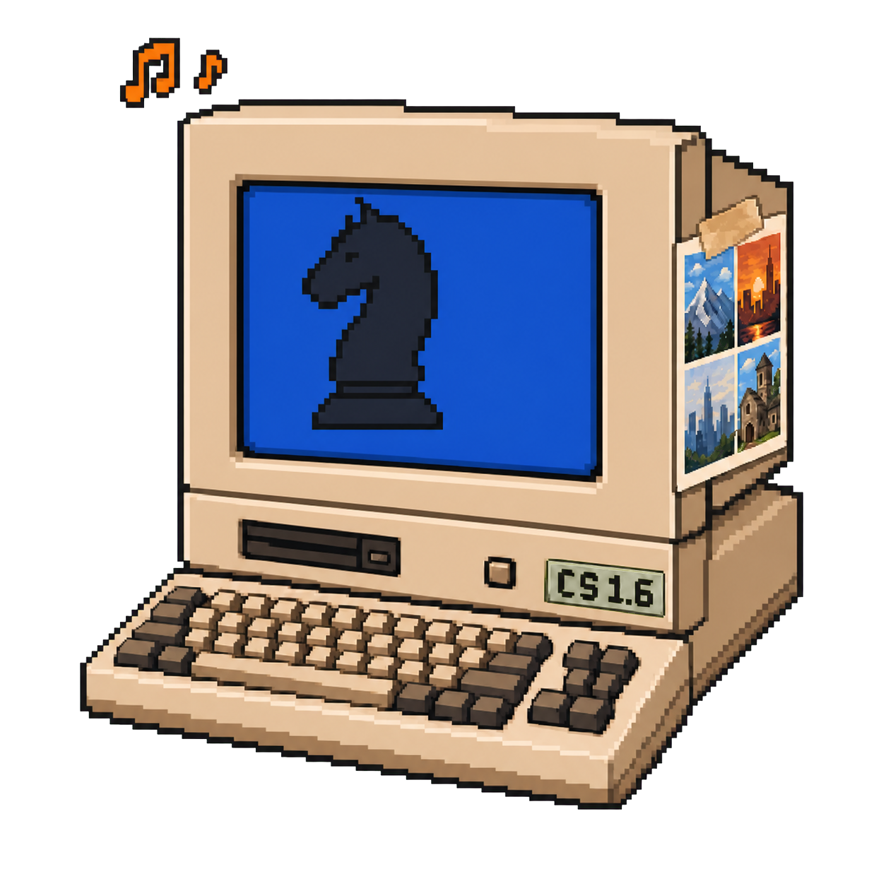

### Keshav Bihani
<sub>backend / AI / side quests</sub>

```diff
! builds backend and AI systems for work;
+ likes building things and solving problems;
+ picks up hobbies, then overbuilds tools for them;
```

### Things I built because I got curious

- Small prompt or model changes can quietly break a pipeline, so I built [**promptry**](https://github.com/bihanikeshav/promptry) to catch regressions locally.
- I got deeper into chess and wanted something closer to a move I could actually spot over the board, rather than Stockfish's 10-move sequence that wins a pawn. [**Chesssy**](https://github.com/bihanikeshav/chesssy)
- I love to sing, but singing does not love me back. So I built [**Pitch Perfect**](https://pitch.meownikov.xyz/) to listen for pitch, technique, and the bits that need work.
- I jump between coding-agent threads and come back later, usually after the cache has expired. I built [**ClaudeCompress**](https://github.com/bihanikeshav/ClaudeCompress) for myself and people like me, so rebuilding that cache does not quietly eat the usage budget.
- I do not want to miss CS matches, but time zones do be hating on me. So I built [**TwitchSnipBot**](https://github.com/bihanikeshav/TwitchSnipBot) to get the highlights. Chat usually knows when the good part just happened.
- I travel a lot and take too many photos. [**selects**](https://github.com/bihanikeshav/selects) finds the keepers, ranked by my taste. It also got rid of my excuse not to post.
- I am building **Kinesis**, a model that estimates what is going on with my muscles from training, food, and sleep. It hyper-optimizes workouts, and now I go to the gym regularly because I want to test the app. *In progress.*
- LLMs are inefficient. Hundreds of greps, turn after turn, just to understand a repo. Markdown drifts as the project grows, multiple engineers use LLMs to code, and nobody knows the design. I am building [**Doer**](https://doerapp.in) because I want to redefine that workflow.

<sub>Most work code is private. Client work is client work. <a href="https://meownikov.xyz/resume.pdf">resume</a></sub>
